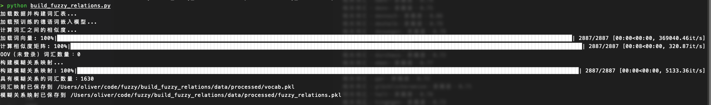
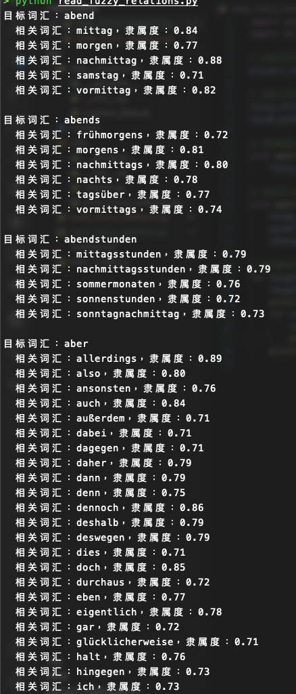

存放项目的源代码，包括数据准备、模型、工具函数等。

data_preparation/

prepare_data.py

包含用于加载和预处理 PHOENIX14T 数据集的代码，例如提取德语句子、构建词汇表和索引映射等。

models/

loss_functions.py

包含自定义的损失函数代码，例如带有模糊控制的交叉熵损失函数。

utils/

helpers.py

包含辅助函数，例如加载词嵌入模型、计算相似度矩阵等。

build_fuzzy_relations.py

主程序，用于构建模糊关系映射并保存到文件。

train_model.py

训练模型的脚本，加载数据、构建模型、训练和评估。

